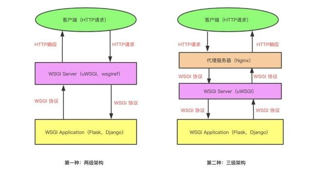

- [1. Progress](#1-progress)
- [2. Introduction](#2-introduction)
  - [2.1. Architecture](#21-architecture)
  - [2.2. Component](#22-component)
- [3. Installation](#3-installation)
  - [3.1. Component](#31-component)
    - [3.1.1. Zabbix-Server](#311-zabbix-server)
    - [3.1.2. MariaDB](#312-mariadb)
    - [3.1.3. Nginx](#313-nginx)
    - [3.1.4. PHP](#314-php)
    - [3.1.5. Zabbix-Server](#315-zabbix-server)
    - [3.1.6. Ansible](#316-ansible)
    - [3.1.7. Jenkins](#317-jenkins)
    - [3.1.8. Proxmox VE](#318-proxmox-ve)
    - [3.1.9. Terraform](#319-terraform)
    - [3.1.10. CMDB](#3110-cmdb)
- [4. CMDB Project Documentation](#4-cmdb-project-documentation)
  - [項目根目錄結構](#項目根目錄結構)


# 1. Progress

內容持續更新中.....

- [x]  架構圖
- [x]  服務安裝筆記
    - [x]  Zabbix-Server
        - [x]  Nginx
        - [x]  PHP
        - [x]  MariaDB
    - [x]  Jenkins
        - [x]  OpenJDK
        - [x]  Jenkins
    - [x]  Promox VE
    - [x]  Terraform
    - [x]  Ansible
- [x]  CMDB
    - [x]  依賴服務
- [x]  CMDB項目細節
    - [x]  根目錄結構
    - [ ]  Table Schema
    - [ ]  各App用途

# 2. Introduction


## 2.1. Architecture


近年資訊業的蓬勃發展下，很多工具或是雲平台如雨後春筍般的出現，像是GCP、Azure、阿里雲、騰訊雲等等平台或像是Ansible、Terraform、SaltStack這種Infrastructure As Code的配置管理工具，而每一家公司至少也都會使用一至多個雲平台，並且當一個雲平台下的帳號不只一個，帳號管理數量一多，常常會發生一些奇葩的事情，項是帳號密碼被某個工程師修改了，但是卻沒有讓到團隊成員知道，或者是某個服務器遷移至某個帳號下管理，團隊內部資訊同樣沒有同步，造成其他成員嘗試多個帳號後才發現已經遷移，而有些團隊很多時候都在這種事情上浪費人力，而這種情況需要被解決，透過一些文章了解ITIL裡面提到的CMDB概念 : 配置管理資料庫(CMDB)是與IT系統所有組件相關的信息庫。它包含IT基礎架構配置項的詳細信息，才衍生出了這個想法，讓團隊成員能夠透過CMDB集中化管理資產訊息、配置等等，並且結合常見的Devops Tools整合所有雲平台內容資產訊息，而團隊成員只需要專注在CMDB上進行機器或者配置的新增、刪除、修改、更新，而不需要再耗費其他時間去熟悉雲平台配置，讓其他成員更有時間去專注在他們的專業領域上。

## 2.2. Component

使用原因

- Terraform : 透過Terraform將雲平台的API封裝，不需要了解API的實際操作方式就能對雲平台操作(新增、刪除、Blabla)，未來當平台切換時也能夠抽換到對應雲平台的Provider。
- Proxmox VE : 恩...因為我沒錢(ಥ﹏ಥ)，剛好這套免費虛擬化技術安裝簡易Terraform又有支援。
- CMDB : 想透過做中學的方式學習Python Django框架。
- Jenkins : 將每一次Ansible執行結果紀錄 ( 想讓CMDB專職管理資產等等內容，而一些特殊客製化內容透過Jenkins pipeline再進行定義 )。
- Ansible : Terraform作為機器初始化的配置管理，而Ansible作為業務層面的配置管理(例如安裝GO、Java、Python)，ython)，另外個人較偏好於使用Agentless方式管理服務器，並且Ansible Galaxy上也有提供許多的Role能夠使用，秉持著Stop Trying to Reinvent the Wheel的精神。
- Zabbix : 服務器建立後可以監控相關資源，透過Ansible配置，一方面也是能夠學習監控領域。


# 3. Installation


## 3.1. Component


### 3.1.1. Zabbix-Server

組成元件

- Nginx
- Zabbix-Server 5.0.4
- MySQL > 【5.5.62 - 8.0.x】  ( 如果MySQL用作Zabbix後端數據庫。 InnoDB引擎是必需的。 MariaDB也能運作在Zabbix之上。)
- PHP > 7.2.0 (PHP在 5.3.3 之後已經將php-fpm寫入php原始碼核心內了。所以已经不需要另外編譯安裝了)

在編譯檔案之前，建議先將基礎編譯所需工具安裝。

```bash
[root@zabbix-server ~]# yum groupinstall -y "Development Tools"
```

共用配置

- Source Code擺放目錄 : `/usr/local/src/`

正式安裝，安裝分為四個部分

- MariaDB ( or MySQL )
- PHP
- Nginx
- Zabbix-Server

### 3.1.2. MariaDB 
此部分安裝使用最簡單的Yum套件管理工具進行安裝

版本

- 10.1

相關設置

- 建立DB，名為zabbix，設置編碼格式為`utf8`以及collate為`utf8_bin`。
- 建立zabbix用戶，並給予zabbix用戶存取zabbix DB的所有存取權限。

建置步驟

1. 新增MariaDB的Yum Repository文件

    ```bash
    [root@zabbix-server ~]# cat << EOF > /etc/yum.repos.d/MariaDB.repo
    # MariaDB 10.1 CentOS repository list - created 2017-01-27 16:31 UTC
    # http://downloads.mariadb.org/mariadb/repositories/
    [mariadb]
    name = MariaDB
    baseurl = http://yum.mariadb.org/10.1/centos7-amd64
    gpgkey=https://yum.mariadb.org/RPM-GPG-KEY-MariaDB
    gpgcheck=1
    EOF
    [root@zabbix-server ~]# 
    ```

2. 安裝`MariaDB`以及`Zabbix所需的MySQL函式庫`

    ```bash
    [root@zabbix-server ~]# yum install -y MariaDB-server MariaDB-client MariaDB-devel MariaDB-shared
    ```

3. 啟動服務以及設置開機啟動

    ```bash
    [root@zabbix-server ~]# systemctl start mariadb.service
    [root@zabbix-server ~]# systemctl enable mariadb.service
    ```

4. 設定MariaDB安全性設置腳本(預設root密碼為空) , 範例透過腳本設定成111111 。

    ```bash
    [root@zabbix-server ~]# mysql_secure_installation
    ```

5. 建立Zabbix資料庫以及其用戶

    ```bash
    # 建立用戶
    MariaDB [(none)]> create database zabbix character set utf8 collate utf8_bin;

    # 給予權限
    MariaDB [(none)]> GRANT ALL PRIVILEGES ON zabbix.* to 'zabbix'@'%' IDENTIFIED  BY '123456' WITH GRANT OPTION;
    ```

### 3.1.3. Nginx

使用編譯方式進行安裝。

版本

- 1.14.0

目錄設置

- 主目錄 : `/usr/local/nginx/`
- 日誌目錄 : `/usr/local/nginx/logs`
- 配置目錄 : `/usr/local/nginx/conf/`
    - vhosts目錄 : `/usr/local/nginx/conf/vshos/`

建置步驟

1. 下載`Nginx source code`

    ```bash
    [root@zabbix-server src]# wget http://nginx.org/download/nginx-1.14.0.tar.gz
    ```

2. 切換目錄到`Nginx源碼目錄`内

    ```bash
    [root@zabbix-server src]# cd nginx-1.14.0
    ```

3. 下載`Zlib`模塊(gzip依賴模塊)

    ```bash
    [root@zabbix-server nginx-1.14.0]# wget http://zlib.net/zlib-1.2.11.tar.gz
    ```

4. 解壓縮`Zlib`模塊 , 切換至目錄內

    ```bash
    [root@zabbix-server nginx-1.14.0]# tar -xvf zlib-1.2.11.tar.gz && cd zlib-1.2.11
    ```

5. 編譯

    ```bash
    [root@zabbix-server zlib-1.2.11]# ./configure 
    [root@zabbix-server zlib-1.2.11]# make 
    [root@zabbix-server zlib-1.2.11]# make install
    ```

6. 回 Nginx 目錄下 , 下載`PCRE`模塊(rewrite依賴)

    ```bash
    [root@zabbix-server zlib-1.2.11]# cd ../ && wget ftp://ftp.csx.cam.ac.uk/pub/software/programming/pcre/pcre-8.42.zip
    ```

7. 解壓縮`PCRE`, 切換到該目錄下

    ```bash
    [root@zabbix-server nginx-1.14.0]# unzip pcre-8.42.zip && cd pcre-8.42
    ```

8. 編譯

    ```bash
    [root@zabbix-server pcre-8.42]# ./configure 
    [root@zabbix-server pcre-8.42]# make 
    [root@zabbix-server pcre-8.42]# make install
    ```

9. 回上一層目錄開始編譯Nginx , 下列為參數用途說明
    - `--prefix指定安装路徑--with-http_ssl_module`指定安裝https模塊
    - `--with-pcre 指定安装PCRE源码路徑`(rewrite依賴)
    - `--with-zlib 指定安装zlib源码路徑`(gzip依賴)。

    ```bash
    #回上層Nginx目錄
    [root@zabbix-server pcre-8.42]# cd ..

    #過程中出現./configure: error: SSL modules require the OpenSSL library.
    #安裝openssl模塊
    [root@zabbix-server nginx-1.14.0]# yum install -y openssl openssl-devel
    #建立Makefile(設置編譯參數)
    ./configure  \
    --prefix=/usr/local/nginx \
    --with-http_ssl_module \
    --with-pcre=./pcre-8.42 \
    --with-zlib=./zlib-1.2.11 

    #開始編譯Makefile
    [root@zabbix-server nginx-1.14.0]# make 

    #安裝
    [root@zabbix-server nginx-1.14.0]# make install
    ```

10. 建立vhosts目錄，方便往後管理

    ```bash
    [root@zabbix-server nginx-1.14.0]# mkdir -p /usr/local/nginx/conf/vhosts/
    ```

11. 配置Zabbix Vitual Hosting，增加配置後需要進行Reload

    ```bash
    [root@zabbix-server nginx-1.14.0]# vim /usr/local/nginx/conf/nginx.conf 
    # 在主配置內引入vhosts配置
    include /usr/local/nginx/conf/vhosts/*.conf;

    # 在加入下列配置到vhosts，子配置檔可以命名為zabbix.conf，依業務名稱容易辨識即可。
    server {
        listen 80;
        server_name zabbix-server.mytest.com;
    		index index.php;

    		# Zabbix UI放置路徑
        root /opt/zabbix-webui/;
        
    		# 後端動態請求轉到後端PHP
        location ~ \.php$ { 
            fastcgi_pass   127.0.0.1:9000;
            fastcgi_index  index.php;
            fastcgi_param  SCRIPT_FILENAME $document_root$fastcgi_script_name;
            include        fastcgi_params;
        }

    }
    ```

12. 設置開機啟動

    ```
    [root@zabbix-server ~]# cat << EOF > /lib/systemd/system/nginx.service
    [Unit]
    Description=nginx
    After=network.target
      
    [Service]
    Type=forking
    ExecStart=/usr/local/nginx/sbin/nginx
    ExecReload=/usr/local/nginx/sbin/nginx -s reload
    ExecStop=/usr/local/nginx/sbin/nginx -s quit
    PrivateTmp=true
      
    [Install]
    WantedBy=multi-user.target

    EOF

    ```

13. 設置開機啟動和啟動服務

    ```bash
    [root@zabbix-server ~]# systemctl start nginx.service
    [root@zabbix-server ~]# systemctl enable nginx.service
    ```

### 3.1.4. PHP

使用編譯方式進行安裝。

版本

- PHP 7.2.34

目錄設置

- 主目錄 : `/usr/local/php/`
- 日誌目錄 :  `/var/log/php/`
- 配置目錄 :  `/usr/local/php/etc/`

1. 安裝PHP 前端需要的庫

    ```
    [root@zabbix-server ~]# yum install -y libxml2 libxml2-devel libjpeg-devel libpng-devel freetype-devel
    ```

2. 下載後解壓進入目錄

    ```
    [root@zabbix-server src]# wget https://www.php.net/distributions/php-7.2.34.tar.bz2
    [root@zabbix-server src]# tar -xvf php-7.2.34.tar.bz2 && cd php-7.2.34
    ```

3. 編譯PHP

    ```
    # 設置編譯參數
    # PHP5使用--with-mysql , PHP7使用--with-pdo-mysql

    [root@zabbix-server php-7.2.34]# ./configure --prefix=/usr/local/php \
    --with-pdo-mysql \
    --enable-fpm \
    --with-config-file-path=/usr/local/php/etc \
    --with-zlib \
    --enable-bcmath \
    --enable-mbstring \
    --enable-sockets \
    --with-gettext \
    --with-jpeg-dir \
    --with-png-dir \
    --with-freetype-dir \
    --with-gd

    # 編譯及安裝
    [root@zabbix-server php-7.2.34]# make && make install
    ```

4. 安裝編譯mysqli的PHP擴充套件。

    新版本的PHP(7以上)需要`mysqli`支持 , mysqli是提供給PHP使用的呼叫mysql所用的函數 , 在PHP進行配置時就無法正常使用PHP存取資料庫 , 必須安裝。

    ```bash
    [root@zabbix-server php-7.2.34]# yum install -y autoconf

    # 切換到source code下的ext/mysqli之下
    [root@zabbix-server php-7.2.34]# cd ext/mysqli

    # 使用phpize生成configure
    [root@zabbix-server mysqli]# /usr/local/php/bin/phpize

    # 建立Makefile , 指定PHP下的php-config配置
    [root@zabbix-server mysqli]# ./configure \
    --with-php-config=/usr/local/php/bin/php-config \
    --with-mysqli

    # 編譯及安裝
    [root@zabbix-server php-7.2.34]#  make && make install

    ```

5. PHP配置

    ```bash
    # 配置php.ini文件(Source Code內的php.ini-production 複製到 PHP配置檔案目錄下)
    [root@zabbix-server php-7.2.34]# cp php.ini-production /usr/local/php/etc/php.ini

    # 加上Zabbix系統要求配置
    [root@zabbix-server php-7.2.34]# vim /usr/local/php/etc/php.ini
    max_execution_time = 300
    post_max_size = 16M
    max_input_time = 300
    date.timezone = "Asia/Taipei"
    always_populate_raw_post_data = -1
    extension=mysqli.so

    # 配置php-fpm.ini文件
    [root@zabbix-server php-7.2.34]# cd /usr/local/php/etc/

    # 複製php-fpm配置範本
    [root@zabbix-server etc]# cp php-fpm.conf.default php-fpm.conf

    # 將pid註解掉 , 啟動PHP-FPM時將會產生pid檔案
    [root@zabbix-server etc]# sed -i 's/;pid = run\\/php-fpm.pid/pid = run\\/php-fpm.pid/g' php-fpm.conf
    ```

6. 啟動PHP以及配置PHP開機啟動

    ```
    [root@zabbix-server ~]# cat << EOF > /lib/systemd/system/php-fpm.service

    [Unit]
    Description=php
    After=network.target

    [Service]
    Type=forking
    ExecStart=/usr/local/php/sbin/php-fpm
    ExecStop=/bin/pkill -9 php-fpm
    PrivateTmp=true
    [Install]
    WantedBy=multi-user.target

    EOF

    [root@zabbix-server ~]# systemctl start php-fpm.service

    ```

### 3.1.5. Zabbix-Server

版本

- Zabbix Server 5

目錄設置

- 主目錄 : `/usr/local/zabbix/`
- 配置目錄 :  `/usr/local/zabbix/etc/`
- 日誌目錄 :  `/usr/local/zabbix/log/`

1. 安裝依賴套件

    ```
    [root@zabbix-server ~]# yum -y install net-snmp net-snmp-devel perl-DBI php-gd php-xml php-bcmath fping OpenIPMI-devel php-mbstring mysql-devel curl-devel
    ```

2. 下載源碼 , 並切換至該目錄

    ```
    [root@zabbix-server ~]# wget https://cdn.zabbix.com/zabbix/sources/stable/5.0/zabbix-5.0.4.tar.gz
    [root@zabbix-server ~]# tar -xvf zabbix-5.0.4.tar.gz && cd zabbix-5.0.4
    ```

3. 建立Zabbix用戶及Group

    ```
    [root@zabbix-server ~]# groupadd zabbix
    [root@zabbix-server ~]# useradd zabbix -g zabbix
    ```

4. 編譯及安裝
參數說明:
    - `--prefix` : 指定安裝目錄
    - `--enable-server` : 安裝Zabbix-Server
    - `--enable-agent` : 安裝Zabbix agent (監控程序)
    - `--with-mysql` : 使用mysql當作後端資料庫
    - `--with-net-snmp` : 啟動SNMP功能
    - `--with-libcurl` : 為了支持SMTP認證 , 用於發送告警郵件需要
    - `--with-libxml2` : 不清楚

    ```
    #過程中如果出現configure: error: Unable to use libevent (libevent check failed)
    [root@zabbix-server ~]# yum install -y libevent libevent-devel

    # 編譯Zabbix-Server
    [root@zabbix-server ~]# ./configure \
    --prefix=/usr/local/zabbix \
    --enable-server  \
    --enable-agent \
    --with-mysql \
    --with-net-snmp \
    --with-libcurl \
    --with-libxml2 

    #編譯及安裝
    [root@zabbix-server ~]# make install
    ```

5. 設置Zabbix目錄權限及配置Zabbix啟動腳本

    ```
    # 變更權限
    [root@zabbix-server ~]# chown -R zabbix:zabbix /usr/local/zabbix/

    # 配置啟動腳本 (For CentOS6)
    [root@zabbix-server ~]# cp /root/zabbix-4.0.1/misc/init.d/fedora/core/zabbix_server /etc/init.d/

    # 配置啟動腳本 (For CentOS 7)
    [root@zabbix-server ~]# cat << EOF > /usr/lib/systemd/system/zabbix-server.service

    [Unit]
    Description=Zabbix Server
    After=syslog.target
    After=network.target

    [Service]
    User=zabbix
    Group=zabbix
    Environment="CONFFILE=/usr/local/zabbix/etc/zabbix_server.conf"
    EnvironmentFile=-/usr/local/zabbix/etc/zabbix_server.conf
    Type=forking
    Restart=on-failure
    PIDFile=/run/zabbix/zabbix_server.pid
    KillMode=control-group
    ExecStart=/usr/local/zabbix/sbin/zabbix_server -c \$CONFFILE
    ExecStop=/bin/kill $MAINPID
    RestartSec=10s
    TimeoutSec=120s

    [Install]
    WantedBy=multi-user.target

    EOF

    [root@zabbix-server ~]# mkdir -p /run/zabbix/
    [root@zabbix-server ~]# chown -R zabbix:zabbix /run/zabbix/

    [root@zabbix-server ~]# mkdir -p /usr/local/zabbix/log/
    [root@zabbix-server ~]# chown -R zabbix:zabbix /usr/local/zabbix/log/

    # 將zabbix做一個軟鏈接 , 以便於執行命令以及提供啟動腳本所調用
    [root@zabbix-server ~]# ln -s /usr/local/zabbix/sbin/zabbix_server /usr/local/sbin/zabbix_server
    ```

6. 配置Zabbix Server文件

    ```
    vim /usr/local/zabbix/etc/zabbix_server.conf 

    # 請依照自身業務配置 , 此為範例
    ListenPort=10051

    # 需要事先建立日誌目錄，否則會出現錯誤
    LogFile=/usr/local/zabbix/log/zabbix_server.log

    # 啟動後程序PID
    PidFile=/run/zabbix/zabbix_server.pid

    # DB連接地址
    DBHost=localhost
    # DB名稱
    DBName=zabbix
    # 連接資料庫用戶名稱
    DBUser=zabbix          
    # 連接資料庫用戶密碼
    DBPassword=123456      

    # Zabbix-Server監聽IP
    ListenIP=0.0.0.0

    # 是否允許使用root身份運行zabbix，如果值為0，並且是在root環境下
    # zabbix會嘗試使用zabbix用戶運行，如果不存在會告知zabbix用戶不存在。
    AllowRoot=0
    User=zabbix
    ```

7. 將數據表導入MariaDB

    1. 先建立名稱為zabbix的數據庫

        ```
        # 進入數據庫
        mysql -u root -p 123456

        #建立zabbix數據庫
        MariaDB [(none)]> create database zabbix default character set utf8;
        ```

    2. 導入數據表

        ```
        [root@zabbix-server zabbix-4.0.1]# cd database/mysql

        # 依序導入及輸入密碼
        [root@zabbix-server mysql]#  mysql -u root -p zabbix < schema.sql      
        Enter password:
        [root@zabbix-server mysql]#  mysql -u root -p zabbix < images.sql 
        Enter password:
        [root@zabbix-server mysql]#  mysql -u root -p zabbix < data.sql 
        Enter password:

        # 檢查Zabbix資料庫是否有產生數據表
        [root@zabbix-server mysql]# mysql -u root -p -e "use zabbix; show tables"
        ```

8. 建立Zabbix Server 日誌路徑以及PID路徑

    ```
    [root@zabbix-server ~]# mkdir -p /usr/local/zabbix/log 
    [root@zabbix-server ~]# mkdir -p /run/zabbix/

    # 注意權限
    [root@zabbix-server ~]# chown zabbix:zabbix /usr/local/zabbix/log 
    [root@zabbix-server ~]# chown zabbix:zabbix /run/zabbix/

    [root@zabbix-server ~]# /etc/init.d/zabbix_server start

    # 錯誤訊息Starting zabbix_server:  /etc/init.d/functions: line 722: /usr/local/sbin/zabbix_server: No such file or directory
    # 原因是找不到執行檔案 , 確認有做軟鏈結

    # 啟動過程中遇到錯誤/usr/local/sbin/zabbix_server: error while loading shared libraries: libpcre.so.1: cannot open shared object file: No such file or directory
    ln -s /usr/local/lib/libpcre.so.1 /lib64/
    ```

9. 配置Zabbix WebUI頁面 , 將Zabbix Source Code下的frontends/php內的資源檔案副
    1. 將source code 下的frontends/php內的檔案放置

        ```
        [root@zabbix_sever_5 ~]# mkdir /opt/zabbix-webui/
        [root@zabbix_sever_5 ~]# cd /opt/zabbix-webui/
        [root@zabbix_sever_5 zabbix-webui]# cp -R /usr/local/src/zabbix-5.0.4/ui/* .
        cp -a . /usr/local/nginx/html/zabbix/
        ```

10. 啟動Nginx 以及php-fpm

    ```
    service nginx start
     /etc/init.d/php-fpm start
    ```

11. 訪問Zabbix頁面 , 出現Access denied , 排查nginx error.log

    ```
    2018/11/23 21:19:46 [error] 55348#0: *1 FastCGI sent in stderr: "Access to the script '/usr/local/nginx/html/zabbix' has been denied (see security.limit_extensions)" while reading response header from upstream, client: 192.168.247.1, server: localhost, request: "GET /zabbix HTTP/1.1", upstream: "fastcgi://127.0.0.1:9000", host: "192.168.247.150"
    ```

    由於 php-fpm 預設安裝在 security.limit_extensions 是僅有支援 .php 的 , 若是你的 Web site 有執行 .htm .html .pl 等等的副檔名就會被擋下來

    - 解決方法為修改php.ini , 將security.limit_extensions註解取消重啟服務

        ```
        security.limit_extensions = .php .php3 .php4 .php5
        ```

    - 另外一種方式則是在Nginx內使用location將特定的後綴結尾導向後端PHP。

12. 上述錯誤解決 , 但又出現了靜態文件訪問404的問題 , 原因是因為`.jpg`、`.css`、`.js`檔案也被當作是PHP , 透過php-fpm去解析了
    - 解決方法就是在Nginx添加一條規則 , 凡是符合靜態文件結尾的檔案都導向Zabbix目錄下

        ```
        location ~* ^.+\\.(ico|gif|jpg|jpeg|png|html|css|htm|bmp|js|svg)$ {
                   root /usr/local/nginx/html/;
        }
        ```

13. 接著就進行網頁安裝Zabbix服務了，Zabbix會先檢測你目前所有服務是否已經配置正確
如果PHP databases support出現Fail情況，確認你已經安裝好mysqli，也在php.ini內配置extension

    ```
    # 重要! 在Zabbix WEB安裝頁面顯示是否支援是由mysqli.so這個檔案去決定
    # 如果沒有這個檔案則會一直顯示databases support，不管你換了幾個版本的Database
    extension=mysqli.so
    ```

    如果有其他錯誤 , 也是先檢查php.ini文件是否達到需求 , 因為zabbix 是檢測php.ini的

14. 配置完成Zabbix後，記得將setup.php檔案刪除。


### 3.1.6. Ansible

此部分安裝使用最簡單的Yum套件管理工具進行安裝Ansible以及其依賴工具。

目錄位置

- 主配置目錄 : `/etc/ansible`
- 主配置檔 : `/etc/ansibleansible.cfg`
- 默認hosts位置 : `/etc/ansible/hosts`

建置步驟

1. 安裝Ansible。

    ```bash
    yum install ansible
    ```

2. 查看版本號確認安裝成功。

    ```bash
    ansible --version

    # ansible 2.9.13
    #  config file = /etc/ansible/ansible.cfg
    #  configured module search path = [u'/root/.ansible/plugins/modules', u'/usr/share/ansible/plugins/modules']
    #  ansible python module location = /usr/lib/python2.7/site-packages/ansible
    #  executable location = /usr/bin/ansible
    #  python version = 2.7.5 (default, Apr  2 2020, 13:16:51) [GCC 4.8.5 20150623 (Red Hat 4.8.5-39)]
    ```

### 3.1.7. Jenkins

組成元件

- OpenJDK 1.8
- Jenkins 2.249.2

此部分安裝使用最簡單的Yum套件管理工具進行安裝JDK以及Jenkins

執行用戶

- jenkins

目錄位置

- 主目錄 : `/var/lib/jenkins`
- 日誌路徑 :  `/var/log/jenkins/jenkins.log`
- 配置檔案路徑 :  `/etc/sysconfig/jenkins`

建置步驟

1. 安裝OpenJDK以及確認版本

    ```bash
    yum install -y java-1.8.0-openjdk

    java -version
    # openjdk version "1.8.0_262"
    # OpenJDK Runtime Environment (build 1.8.0_262-b10)
    # OpenJDK 64-Bit Server VM (build 25.262-b10, mixed mode)
    ```

2. 加入Jenkins Yum Repository以及Import key

    ```bash
    wget -O /etc/yum.repos.d/jenkins.repo https://pkg.jenkins.io/redhat-stable/jenkins.repo
    rpm --import https://pkg.jenkins.io/redhat-stable/jenkins.io.key
    ```

3. 安裝Jenkins

    ```bash
    yum install jenkins
    ```

4. 啟動服務及設置開機啟動

    ```bash
    systemctl start jenkins
    systemctl enable jenkins
    ```

### 3.1.8. Proxmox VE

[https://wiki.freedomstu.com/books/proxmox-ve-虛擬系統記錄/page/proxmox-ve-安裝流程](https://wiki.freedomstu.com/books/proxmox-ve-%E8%99%9B%E6%93%AC%E7%B3%BB%E7%B5%B1%E8%A8%98%E9%8C%84/page/proxmox-ve-%E5%AE%89%E8%A3%9D%E6%B5%81%E7%A8%8B)

### 3.1.9. Terraform

Terraform 的安裝非常簡單，直接把官方提供的二進制可執行文件保存到 /usr/local/bin/ 目錄下，當然這個目錄會被添加到 PATH 環境變量中，就能夠直接使用terraform命令。

完成後透過`terraform version`命令檢查一下版本號。

### 3.1.10. CMDB

使用的是三層架構




服務面向組件
- `Nginx` : 作為Reverse Proxy，將客戶端請求轉發到後端WSGI Web Server (未來慢慢將專案前後端進行分離，由Nginx處理前端靜態資源，而Uwsgi處理動態資源請求)。
- `uWSGI` : 實現WSGI協議的Web Server，透過WSGI協議與WSGI Application溝通(Django、Flask、Tornado)，為何需要Nginx作為反向代理的原因是因為uWSGI對靜態資源處理效率不如Nginx，也可以透過Nginx做負載平衡。
- `MySQL` : 數據存儲。

系統管理面向組件

* `supervisord` : 守護進程，用於管理uWSGI程序存活，若崩潰自動重啟，也因為配置檔案容易設置的原因，就沒有考慮使用systemd。


Nginx配置
1. 設置Vhost目錄，依照業務功能拆分配置檔案，透過主配置檔include相應配置檔，易於後續管理
   ```shell
    server {
        listen 80;
        server_name cmdb.aspk7.com ;

        access_log logs/access_cmdb.log;
        error_log logs/error_cmdb.log;

        # 將除了靜態資源內容(URI非/static)的請求全部轉發至uWSGI
        location / {
            include uwsgi_params;
                    
            # Nginx與Uwsgi在此專案是存在同一個Server上的，uWSGI是監聽127.0.0.1:9005。
            uwsgi_pass 127.0.0.1:9005;
            
            # nginx 請求到 uwsgi 超時設置
            uwsgi_send_timeout 30s;
            
            # uwsgi 返回數據到 nginx 的超時設置
            uwsgi_read_timeout 30s;
        }
        
        # 將請求靜態資源內容的請求，使用專案靜態資源目錄作為相對存取位置。
        location /static {
            alias /web/cmdb/static/; 
        }
    }
   ```

supervisor配置 
* 使用`supervisor`服務管理uwsgi進程
* 配置檔案路徑：`/etc/supervisord.d/cmdb.ini`
  ```shell
    [program:cmdb]
    # --ini 後面路指定到目錄下的uwsgi.ini
    command=/usr/local/bin/uwsgi --ini /web/cmdb/uwsgi.ini
    directory=/web/cmdb/
    startsecs=0
    stopwaitsecs=0
    autostart=true
    autorestart=true
  ```
* 啟動方式：`supervisorctl start cmdb`
* 停止方式：`supervisorctl stop cmdb`


uwsgi配置
* 配置檔路徑：`/web/cmdb/uwsgi.ini`
  ```shell
    [uwsgi]
    # 设置虚拟目录, 独立套件版本避免冲突
    virtualenv = /web/cmdb/venv/

    # 指定uwsgi在哪個目錄, 指定專案根目錄
    chdir = /web/cmdb/

    # 加载指定的WSGI文件
    wsgi-file = cmdb/wsgi.py

    # 告知uWSGI使用程序入口名称为app, 一般若不指定callable的入口名称的话默认为applivation
    callable = application

    # PID存放位置
    pidfile = %(chdir)/logs/uwsgi.pid
    # 指定uwsgi的客户端将要连接的socket的路径（使用UNIX socket的情况）或者地址（使用网络地址的情况）
    socket = 127.0.0.1:9005

    # 设置线程数量以及进程数
    process = 1
    threads = 2

    # 使Process在后台运行 , 并将日志打印到指定的文件内
    logto = %(chdir)/logs/uwsgi.log

    # 设置日志
    logdate = %%Y-%%m-%%d %%H:%%M:%%S

    # 代码有更动后自动进行reload
    py-autoreload = 1

    # 启动主进程
    master = true

    # 設置Buffer , 避免在uWSGI寫入OSError: write error
    buffer-size=8192
    ignore-sigpipe=true
    ignore-write-errors=true
  ```
* uWSGI日誌路徑：`/web/cmdb/logs/uwsgi.log`
* PID存放路徑：`/web/cmdb/logs/uwsgi.pid`


# 4. CMDB Project Documentation

## 項目根目錄結構

```shell
.
├── assets
├── cmdb
├── login
├── logs
├── manage.py
├── ReadMe.md
├── requirements.txt
├── scripts
├── static
├── templates
├── uwsgi.ini
└── venv
```

各目錄及檔案用途說明
- `cmdb`：專案入口目錄
    - `settings.py`：主配置文件 , 全域變數配置 , 例如DB連接資訊、JWT過期時間配置等。
    - `wsgi.py`：uwsgi入口文件。
    - `urls.py`：一級路由配置 , 若有新增其他的Django APP , 需要從一級路由引入 , 目前有兩個APP分別為`assets`、`login`。
- `assets`：展示模塊，細部說明請移動至assets app目錄結構說明章節。
- `login`：登入模塊，細部說明請移動至login APP目錄結構說明 。
- `logs`：存放uwsgi日誌內容以及PID文件。
- `manage.py`：Django內建管理工具。
- `requirements.txt`：項目所需安裝第三方套件。
- `scripts`：腳本類的放置路徑，例如刷新CDN的代碼。
    - `config/account.ini`：放置阿里雲API配置，如Key & Secret有修改，在此更改。
- `static`：共用靜態文件存放位置，某一些頁面的靜態資源都是一樣的 ，所以將共用資源抽離出來放置在該目錄之下。
- `templates`：基底模板，項目內的其他html頁面會繼承該基底模板在進行功能的擴展。
- `uwsgi.ini`：uwsgi服務配置文件。
- `venv`：Python虛擬環境。